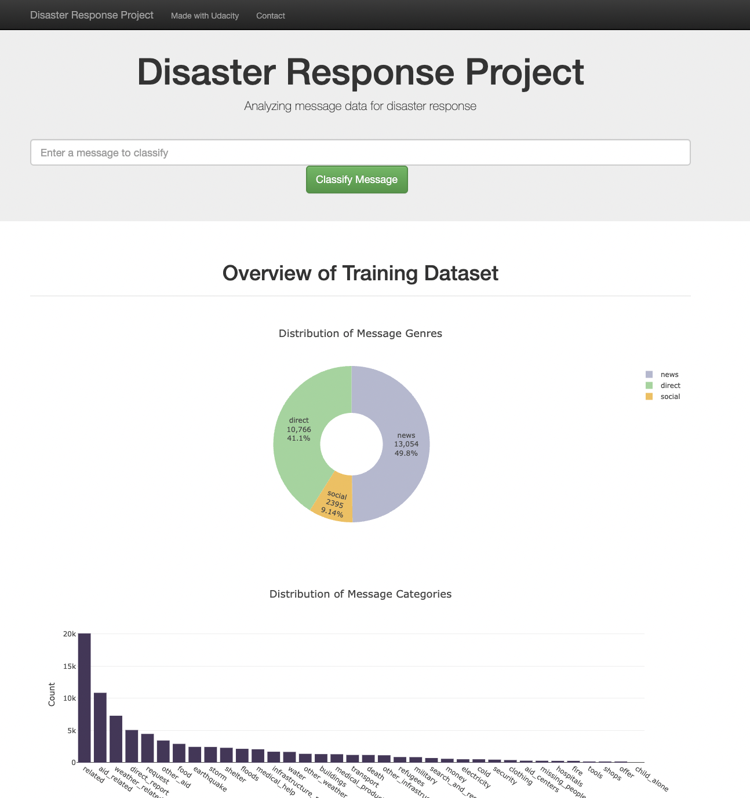
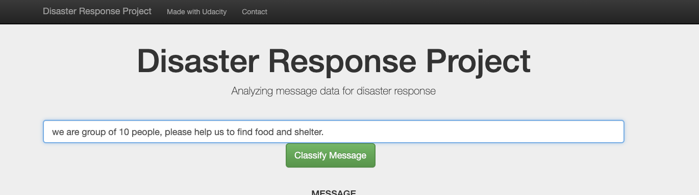
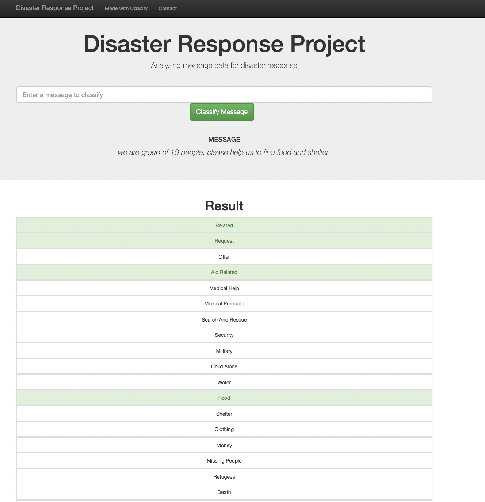

# Disaster Response Pipeline Project

### Table of Contents
1. [Goal](#goal)
2. [Description](#description)
3. [Getting Started](#getting_started)
	1. [Dependencies](#dependencies)
	2. [File Structure](#file_structure)
	3. [Installing](#installation)
	4. [Instructions](#instructions)
	5. [Deployment!](#production)
4. [Screenshots](#screenshots)
4. [Acknowledgement](#acknowledgement)
5. [License](#license)

<a name="goal"></a>
### Goal
This project is designed to showcase the data and ML capabilities to deliver the solution for real-world problems, In this project, we collected the labelled data of the disaster relief agency and we create a beta app to categorise this event so that we can send messages to the appropriate disaster relief agency. 

<a name="description"></a>
### Description
This is built on top of a Natural Language Processing (NLP) trained model, and training based on the various prelabed dataset. This project is part of Data Science Nanodegree Program by Udacity in collaboration with Figure Eight.

Projects includes 
1. Data pipeline to clean, balance, select the relavent entities.
2. Saved the output of the data pipeline to the SQLite database.
3. Used processed data, to create ML model for the disaster relief.
4. Expose the model with the help of web app to classify messages in real time.

<a name="getting_started"></a>
### Getting Started
<a name="dependencies"></a>
#### Dependencies
* Python 3.8
* Notebook: Jupyter Notebook
* SQLite database libraries: SQLalchemy
* Data analysis libraries: Pandas, Numpy
* Machine Learning libraries: Scikit-Learn
* Natural Language Processing libraries: NLTK
* Web App and Data Visualization libraries: Flask, Plotly

<a name="file_structure"></a>
#### File Structure
```
- app
| - template
| |- master.html  # main page of web app
| |- go.html  # classification result page of web app
|- run.py  # Flask file that runs app

- data
|- disaster_categories.csv  # data to process 
|- disaster_messages.csv  # data to process
|- process_data.py.       # preprocessing of csv files
|- DisasterResponse.db   # database to save clean data

- models
|- train_classifier.py
|- classifier.joblib  # saved model 

- notebook
|- etl_pipeline.ipynb  # Note book of the ELT work
|- ml_pipeline.ipynb  # Note book of ML work

- sceenshots
|- 1.png
|- 2.png
|- 3.png

- README.md
- LICENSE
```


<a name="installation"></a>
### Installing
* Clone the repository.
    ```
    git clone https://github.com/iamkamleshrangi/disaster-response.git
    ```
* Proper conda/virtualenv enviroment ready with python3+.
* Install the necessary libraries provided in requirements.txt file.
* Follow the instructions provided in the next section.


<a name="instructions"></a>
#### Instructions

Instructions:
1. Run the following commands in the project's root directory to set up your database and model.

    - To run ETL pipeline that cleans data and stores in database
        `python data/process_data.py data/disaster_messages.csv data/disaster_categories.csv data/DisasterResponse.db`
    - To run ML pipeline that trains classifier and saves
        `python models/train_classifier.py data/DisasterResponse.db models/classifier.pkl`
	
2. Run the following command in the app's directory to run your web app.
    `python run.py`

3. Go to http://0.0.0.0:3001/

<a name="production"></a>
#### Deployment
production: To deploy the project live, you need a cloud service provider like AWS, then run the app.py on the server and access the service with the help of server_public_ip:3001 url, however I suggest to run app on the nginx as server and postgres as database. 

development: You can run it based on your requirement.

### Screenshots!

1. The main page shows some graphs about training dataset



2. Input as an example of a message



3. Click Classify Message, the message will be categorized and the belonging message categories will highlighted in green.




<a name="acknowledgements"></a>
## Acknowledgements
* [Udacity](https://www.udacity.com/) for proposing this project as part of the Data Science Nanodegree Program.
* [Figure Eight](https://www.figure-eight.com/) for providing the data.
<a name="license"></a>

## License
[](https://opensource.org/licenses/MIT)


